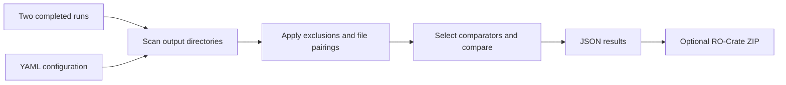

# Workflow output comparison tool

For an isolated installation, see [Docker build and usage](DOCKER.md).

Compare the outputs of two completed workflow runs, using format-aware tolerances or exact checksums. Export JSON or an RO-Crate ZIP containing the report, configuration and input references/files.

This tool compares output contents. It does not launch workflows or benchmark execution time, CPU or memory.

## Start in a minute

Python 3.10+ is required. From this repository:

```bash
python -m venv .venv
source .venv/bin/activate
python -m pip install ".[all,test]"
mkdir -p reports
compare directory examples/run1 examples/run2 \
  --config examples/comparison.yml --dry-run
compare directory examples/run1 examples/run2 \
  --config examples/comparison.yml --output reports/comparison.json --verbose
python -m pytest -q
```

The example compares two slightly different TSVs that match within the declared absolute tolerance. The command only reads the input directories.

For real outputs:

```bash
compare directory /path/to/run1 /path/to/run2 \
  --subdir outputs --config my-comparison.yml \
  --crate --output reports/comparison.zip
```

Add `--include-files` to embed the run directories. Without it, the crate contains logical run IDs and artifact hashes; it will not carry the underlying outputs to another machine. Embedding includes the supplied run directories, not only the selected subdirectory or compared files.

## Workflow



Run `--dry-run` first to review pairing. Then compare and inspect both the overall status and individual mismatches/errors. Exclusions and tolerances determine what the result establishes: a passing report is agreement under that policy, not proof that every aspect of two runs is identical.

## Parameters

| Parameter | Default | Meaning |
|---|---|---|
| `directory RUN1 RUN2` | Required | Two existing run directories. This is the supported CLI subcommand. |
| `--config`, `-c` | Required | YAML defining comparators, pairing and exclusions. |
| `--subdir`, `-s` | `.` | Directory to scan inside each run. Paths in YAML are relative to it. |
| `--output`, `-o` | `comparison_result.json` / `comparison.crate.zip` | Output path; ZIP default applies with `--crate`. Parent directory must exist. |
| `--verbose`, `-v` | Off | Print per-file results. |
| `--dry-run` | Off | Validate config and list pairings without comparing or writing results. |
| `--crate` | Off | Package the report/config and run references as an RO-Crate ZIP. |
| `--include-files` | Off | Embed both run directories; requires `--crate`. |
| `--custom` | Off | Force custom comparison for every pair. Usually prefer `type: generic` on selected patterns. |

See [usage.md](usage.md) for YAML settings, custom programs and interpretation.

## Dependencies

| Install | Support |
|---|---|
| `pip install .` | Core CLI, YAML, RO-Crate, NumPy, pandas and DataComPy; binary/CSV/TSV/JSON/NPY/NPZ comparison. |
| `pip install ".[images]"` | scikit-image and Pillow for SSIM image comparison. |
| `pip install ".[hdf5]"` | h5py for numeric/string/scalar datasets, groups and attributes. |
| `pip install ".[bio]"` | Biopython and pysam for FASTA/BAM/SAM/VCF. |
| `pip install ".[excel]"` | openpyxl for XLSX. |
| `pip install ".[all,test]"` | All format dependencies plus pytest. |

The manifest declares dependencies; it is not a complete environment lock. Record the environment used for any reference comparison. A missing optional dependency is an execution error, not an output difference.

## Status and development

Exit **0**: PASS. Exit **1**: FAIL or NOT_CHECKED (including no compared pairs). Exit **2**: invalid input/config or comparison execution ERROR. A valid dry run exits 0 but does not establish reproducibility.

The test suite covers format comparators, routing/pairing, CLI failure modes and RO-Crate packaging. CI runs it on Python 3.12. Legacy per-file `CrateManager` integration is unsupported; use the CLI `--crate` option or `ComparisonCrateWriter`. The older prototype files are not part of active dispatch. Version 0.3 adds semantic JSON and NumPy comparison, Parquet support, strict settings and required-output validation; see the migration notes in [usage.md](usage.md).
